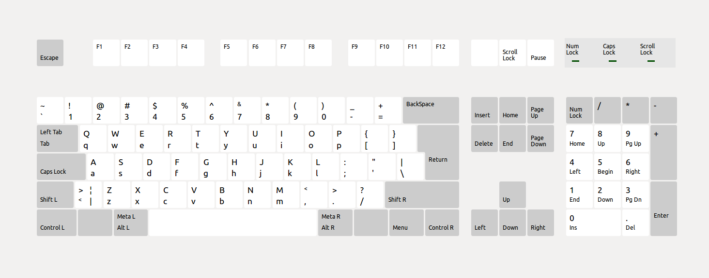

How to use the input devices:
-----------------------------

The gamepad, keyboard and mouse input does behave on Android, Linux and Windows the same.

Gamepad:   
  
Two gamepads are supported and the first two devices found are used.
Axis values are adjusted, that the values are the same on all OSes.

Keyboard:   
  
If a key is not named in the above image (except space), the key can not be queried.

Mouse:  
Left, middle and right buttons are supported. Also, the mouse wheel can be queried.
