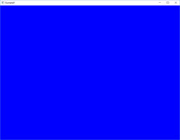
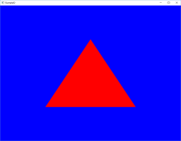
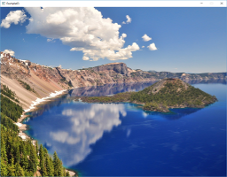
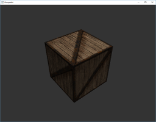
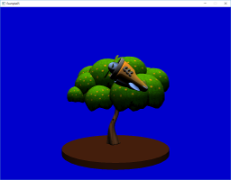
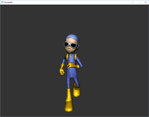
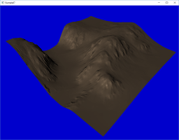
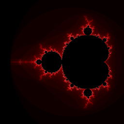

Vulkan examples using VulKan ToolS (VKTS):
------------------------------------------

Features of VKTS:  
[VulKan ToolS (VKTS)](../VKTS/README.md)

Building on Android, Linux and Windows:  
[How to build the VKTS examples](BUILD.md)

Gamepad, keyboard and mouse input:  
[How to use the input devices](INPUT.md)

Executables, assets and shaders:  
[VKTS Binaries](../VKTS_Binaries/README.md)

Exporter for the scene file format:  
[VKTS Exporter](../VKTS_Exporter/README.md)

Used headers and pre-build libraries:  
[VKTS External libraries](../VKTS_External/README.md)

Vulkan examples based on VKTS:
------------------------------

[VKTS_Example01](../VKTS_Example01) - Initializing Vulkan and clearing the background.  
  
  
  
[VKTS_Example02](../VKTS_Example02) - Rendering of a red triangle.  
  
  
  
[VKTS_Example03](../VKTS_Example03) - Rendering of a full screen texture.  
  
  
  
[VKTS_Example04](../VKTS_Example04) - Loading and rendering of an animated, mip mapped textured cube.  
  
  
  
[VKTS_Example05](../VKTS_Example05) - Phong rendering of a tree and an animated plane with several animations.  
  
  
  
[VKTS_Example06](../VKTS_Example06) - Skeletal animation plus camera movement depending on gamepad input.  
  
  
  
[VKTS_Example07](../VKTS_Example07) - Multi-threaded terrain rendering using normal and displacement mapping.
      
The terrain scene has 64 patches, which are processed in parallel by several threads. Only if a patch is visible by the camera, it is added to the secondary command buffers. After all patches are processed, the primary command buffer is drawing the terrain by executing the above secondary command buffers.    
    
  
  
  
[VKTS_Example08](../VKTS_Example08) - Calculating and drawing of the Mandelbrot set using the core Vulkan API.
      
This example uses only the core Vulkan API, so no extensions are activated. A compute shader is calculating the Mandelbrot set and is storing the values into an offscreen image. As soon as the compute shader is done, the final image is saved as a TGA image to the file system.      
    

  
  
VKTS test program:
------------------

VKTS_Test_General - VKTS internal test program, to verify general functions.

VKTS_Test_Input   - VKTS internal test program, to verify input functions.
  
  
VKTS presentations:
-------------------

[Khronos Munich Chapter Meeting 04/08/2015](presentations/Khronos_Chapter_VKTS.pdf) - "VulKan ToolS - Filling the gap between driver and application."
